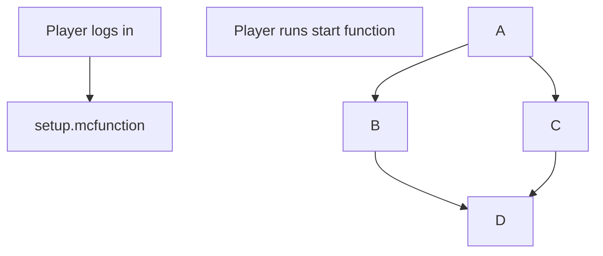
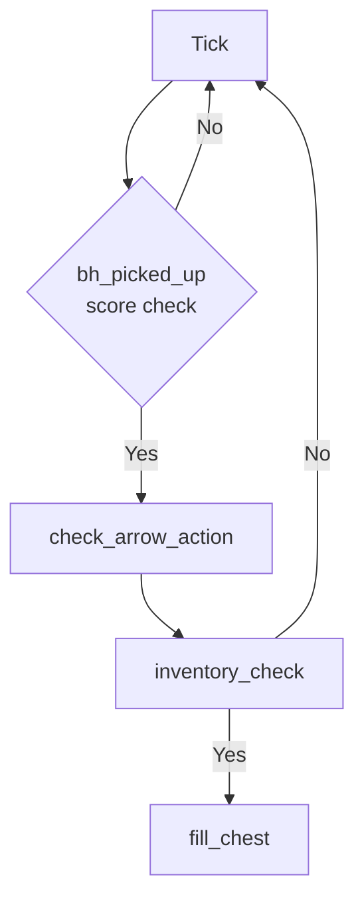
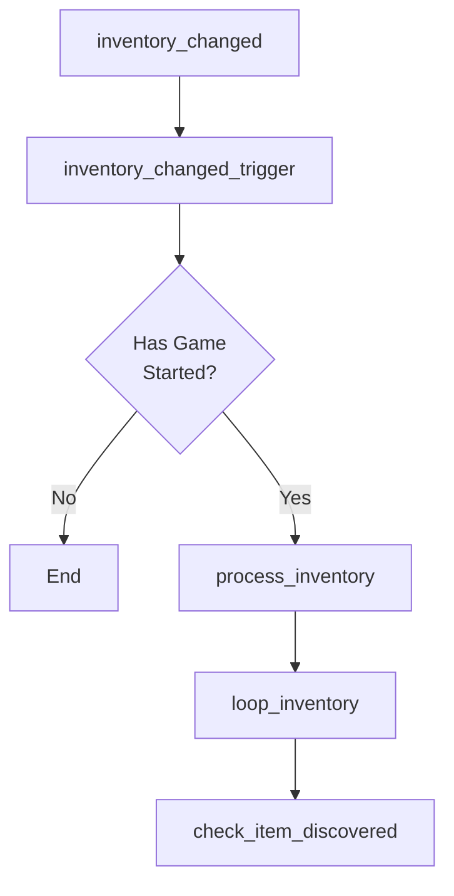

# Border Hoarder

```mermaid

graph TD;
    LogIn[Player logs in]
    Setup[setup.mcfunction]

    LogIn-->Setup
    Start[Player runs start function]
    A-->B;
    A-->C;
    B-->D;
    C-->D;

```

```mermaid
graph TD;
    Tick
    HoldingArrow{bh_picked_up<br />score check}
    check_arrow_action

    Tick-->HoldingArrow
    HoldingArrow-- No -->Tick
    HoldingArrow-- Yes -->check_arrow_action
    check_arrow_action-->inventory_check
    inventory_check-- No -->Tick
    inventory_check-- Yes -->fill_chest
```

```mermaid
graph TD;
    inventory_changed
    GameStarted{Has Game<br />Started?}
    inventory_changed-->inventory_changed_trigger
    inventory_changed_trigger-->GameStarted
    GameStarted-- No --> End
    GameStarted-- Yes --> process_inventory
    process_inventory-->loop_inventory
    loop_inventory --> check_item_discovered
```
